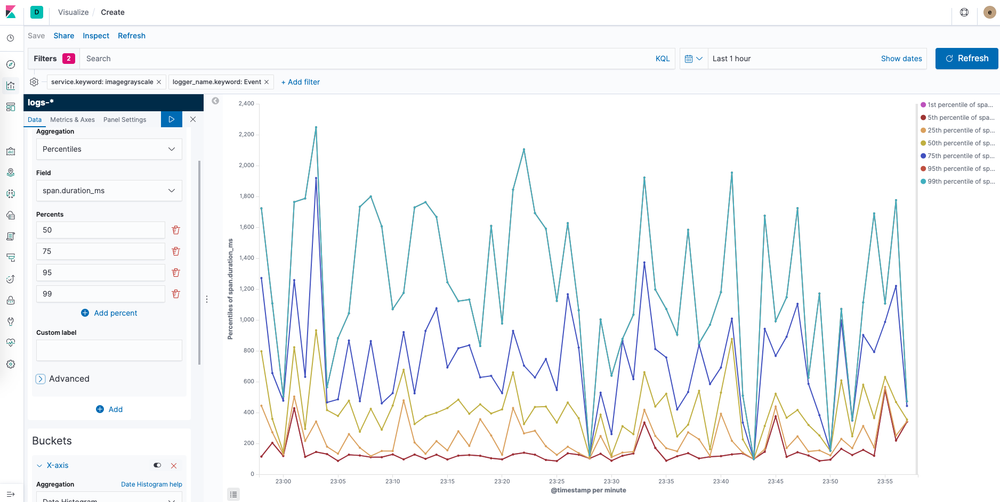

# Events Tasks Solutions

For solving the tasks use kibana and zipkin.

1. Query: Find an event of the service imageflip (together)
   * in the kibana UI
   * navigate to the "Discover" menu
   * select the `events-*` index pattern
   * add a filter on the field `service.keyword`
   * use the operator `is`
   * select/type the value imageflip

2. Query: Find all imageflip transactions that have a duration higher than 1000ms (last 10h). Which one took the longest?
   * keep the filter from before
   * lookup a document and search for the field representing duration: `event.duration_ms`
      * it should be `number` typed, can be recognized by the `#` in front of it
      * **Caution: if the field is not available of text typed, this task is not doable**
   * add a filter for that field
      * operator: `is between`
      * values: `1000` and a very large number like `1000000`

3. Visualize: percentiles of durations of imagegrayscale events.
   * navigate to the "Visualize" menu
   * create new visualization
   * select line chart on the event-* index pattern
   * under Data > Metrics > Y-Axis select `percentiles` aggregation
      * as field set `event.duration_ms`
      * pick useful percentiles buckets, eg: 50, 75, 95, 99
   * under Data > Buckets add X-Axis
      * as aggregation select `Date Histogram`
      * as field select `@timestamp`
   * click `Update` to apply
   * select a reasonable timespan to look at (top right)
   * Example:
